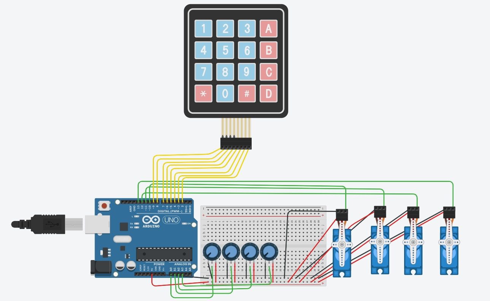

# Robotic-Arm-suing-Arduino

This is my project of Robotic and it's applications. i have implemented this project Arduino UNO. Since, we have this pandemic, I was unable to implement on Hardware Scale but
I have implemented this project on software, TinkerCad.

# My Hardware Simulation circuit:

